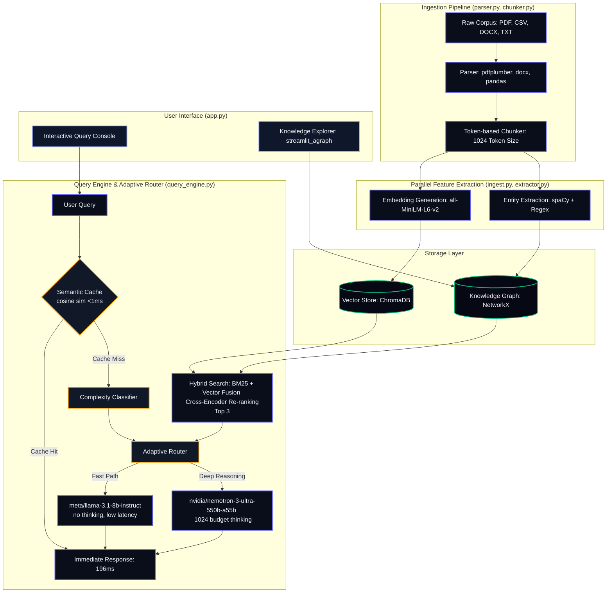

# AI for Industrial Knowledge Intelligence

**ET AI Hackathon 2026 — Problem Statement 8**

A premium, production-ready RAG-powered system that ingests heterogeneous industrial documents (regulatory guides, safety manuals, work orders, permits, incident reports) and provides cited, confidence-scored answers by merging semantic vector search with a structured knowledge graph.

---

## 🏗️ Architecture



---

## 📂 Repository Structure

The project codebase is organized as follows:

```
├── data/                       # Ingested and generated data
│   ├── benchmarks/             # Ground-truth Q&A pairs for evaluation
│   │   └── qa_pairs.json
│   ├── corpus/                 # Source document corpus
│   │   ├── real/               # Regulatory guides (OISD, DGMS, Factory Act)
│   │   ├── synthetic/          # Generated logs (CSV work orders, permits, etc.)
│   │   └── uploads/            # Persistent user-uploaded files
│   ├── chroma_db/              # ChromaDB vector store files
│   ├── documents.json          # Metadata registry tracking ingested documents
│   ├── knowledge_graph.json    # Serialized NetworkX knowledge graph
│   ├── regulatory_templates.py # Seed templates for circulars
│   └── synthetic_data_generator.py # Faker-based generator for CSV logs
│
├── src/                        # System source code
│   ├── main.py                 # FastAPI application and endpoints
│   ├── config.py               # Pydantic configuration & environment variables
│   ├── app.py                  # Streamlit frontend application (agraph-visualized)
│   ├── api/                    # API Route controllers
│   ├── pipeline/               # Ingestion pipeline modules
│   │   ├── parser.py           # TXT, PDF, DOCX, and CSV Row parsers
│   │   ├── chunker.py          # Paragraph/Sentence boundary chunker
│   │   ├── embedder.py         # Local SentenceTransformer vector embedding
│   │   ├── extractor.py        # spaCy + Regex entity extraction
│   │   ├── compliance.py       # Regulatory gap analysis
│   │   └── ingest.py           # Ingestion pipeline coordinator
│   ├── storage/                # Database wrappers
│   │   └── chroma_store.py     # ChromaDB vector collection manager
│   ├── graph/                  # Knowledge graph components
│   │   └── knowledge_graph.py  # NetworkX knowledge graph constructor & query
│   └── utils/                  # Shared helper scripts
│
├── tests/                      # Verification suites
│   ├── test_chromadb.py        # Core vector store integration test
│   ├── test_knowledge_graph.py # Knowledge graph construction and traversal test
│   └── verify_endpoints.py     # FastAPI backend end-to-end endpoint verification
│
├── requirements.txt            # System dependencies
└── README.md                   # Project documentation
```

---

## 🛠️ Key Components & Status

### 1. Document Ingestion & Parsing
- Parses PDF files page-by-page using `pdfplumber`.
- Parses Microsoft Word files (.docx) using `python-docx`.
- Parses plain text files (.txt) using standardized encoders.
- Parses industrial logs (.csv) using `pandas` row-by-row. Each row (e.g. work orders, incident reports, permits) is transformed into a self-describing, search-friendly textual block and embedded individually.

### 2. Entity Extraction & NLP
- Integrated **spaCy** (`en_core_web_sm`) alongside pre-compiled domain-specific **Regex patterns**.
- Automatically extracts:
  - **Equipment tags** (e.g., `EQ-1001`, `PUMP-A01`, `TNK-T02`, `COMP-C01`)
  - **Work permits** (e.g., `PRM-2026-5000`)
  - **Work orders** (e.g., `WO-2026-1000`)
  - **Inspection logs** (e.g., `INS-2026-8000`)
  - **Incident reports** (e.g., `INC-2026-9000`)
  - **Regulation references** (e.g., `OISD-116`, `DGMS Circular 2022-05`, `Factory Act Section 36`)
  - **Plants & Locations** (e.g., `Refinery Unit A`, `Steel Mill D`)
  - **Hazards & Injury Severities** (e.g., `Fire hazard`, `Lost Time`)
  - **Personnel** (using spaCy NER `PERSON`)

### 3. Knowledge Graph
- Constructed using **NetworkX** to map relationships between files, equipment, regulations, hazards, and plants.
- Establishes explicit links (e.g., `EQUIPMENT --[REGULATED_BY]--> REGULATION`, `WORK_ORDER --[PERFORMS_ON]--> EQUIPMENT`, `INCIDENT --[OCCURRED_AT]--> PLANT`).
- Serialized to `data/knowledge_graph.json` and supports graph traversal queries for context expansion.

### 4. Regulatory Compliance Checker
- Automated compliance check module comparing regulatory requirements against ingested plant procedures to identify gaps, compliance status, and highlight supporting evidence.

---

## 🛠️ Project Timeline & Status

### Day 1 — Foundations (Completed)
- [x] Initialized project repository and Python virtual environment (`.venv`).
- [x] Configured project settings using `pydantic-settings` loaded from `.env`.
- [x] Generated seed templates for regulatory guidelines (OISD, DGMS Circulars, and Factory Act sections).
- [x] Implemented Faker-based generator for synthetic plant data (work orders, work permits, inspection logs, and incident reports).
- [x] Prepared ground-truth dataset comprising 18 complex Q&A pairs for system evaluation.
- [x] Configured and verified local vector database connectivity (ChromaDB).

### Day 2 — Ingestion Pipeline & UI Skeleton (Completed)
- [x] **Document Parsing Module (`parser.py`)**: Structured parsers for plain text, PDFs, Word, and CSV rows.
- [x] **Ingestion Pipeline Coordinator (`ingest.py`)**: Coordinates parsing, chunking, embedding, and indexing status updates.
- [x] **FastAPI Ingestion & Search Server (`main.py`)**: Created endpoints for initialize, upload, documents, and query.
- [x] **Streamlit Web UI (`app.py`)**: Created interface with Chat Q&A, Document Library, and Control Center tabs.

### Day 3 — Entities & Knowledge Graph (Completed)
- [x] **spaCy + Regex Entity Extractor (`extractor.py`)**: Extracts equipment tags, regulations, permits, plant locations, and hazards.
- [x] **NetworkX Knowledge Graph (`knowledge_graph.py`)**: Constructs and persists typed nodes and relationships row-by-row to prevent cross-contamination.
- [x] **FastAPI Graph & Search Endpoints (`main.py`)**: Implemented `/graph`, `/graph/search`, `/graph/node/{node_id}`, and `/graph/top`.
- [x] **Streamlit Graph Visualization (`app.py` & `pages/1_Knowledge_Explorer.py`)**: Integrated interactive visualizer utilizing stabilized Vis.js parameters and created a detailed Knowledge Explorer page.
- [x] **Unit Testing (`tests/test_knowledge_graph.py`)**: Added test coverage validating graph queries, subgraphs, and stats.

---

## 🚀 Quick Start

### 1. Set Up Environment
Ensure you have Python 3.10+ installed:
```bash
# Clone the repository
git clone https://github.com/Shivala-08/economic-times-hackathon.git
cd economic-times-hackathon

# Initialize virtual environment
python3 -m venv .venv
source .venv/bin/activate

# Install dependencies
pip install -r requirements.txt
```

### 2. Ingest the Data & Build the Graph
Populate the vector database and construct the knowledge graph from the pre-bundled document corpus:
```bash
PYTHONPATH=. python src/pipeline/ingest.py
```

### 3. Launch the Backend
Start the FastAPI server:
```bash
PYTHONPATH=. uvicorn src.main:app --host 0.0.0.0 --port 8000
```

### 4. Launch the Frontend
In a separate terminal tab (with active virtual environment), run:
```bash
streamlit run src/app.py --server.port 8501
```
Open **`http://localhost:8501`** in your browser to interact with the application.

---

## ⚡ Optimization Architecture

The system underwent a three-tier optimization pass that improved accuracy from **77.8% → 100%** and reduced average latency from **10.3s → 771ms**.

### Tier 1 — Correctness Fixes
| Change | File | Impact |
|---|---|---|
| Graph context from chunk metadata entities | `query_engine.py` | Entities extracted from retrieved chunks, not just query text |
| Chunk size 1024 + 200 overlap | `config.py` | Prevents split-section failures across regulatory docs |
| Embedding similarity scoring (cosine ≥ 0.65) | `main.py` | Replaces brittle keyword overlap with semantic matching |
| Max tokens cap 640 | `config.py` | Reduces unnecessary output generation time |

### Tier 2 — Latency & Precision
| Change | File | Impact |
|---|---|---|
| Query-side regex fallback | `query_engine.py` | Extracts equipment tags, OISD codes when spaCy returns 0 entities |
| Cross-encoder re-ranker (`ms-marco-MiniLM-L-6-v2`) | `query_engine.py` | Re-ranks top-10 → top-3 chunks for precision |
| Per-query complexity classifier | `query_engine.py` | Gates `reasoning_budget` (0 vs 1024) per query |
| Semantic cache (500 entries, 0.95 threshold) | `query_engine.py` | Skips LLM on near-duplicate queries |

### Tier 3 — Streaming & UX
| Change | File | Impact |
|---|---|---|
| `stream_generate()` generator | `llm.py` | Yields tokens from NIM streaming API |
| `/query/stream` SSE endpoint | `main.py` | Server-Sent Events with token + metadata + done events |
| `try/finally` error recovery | `main.py` | Metadata+done events always fire, even on mid-stream errors |
| Streamlit streaming consumer | `app.py` | Real-time token rendering via `httpx.Client.stream()` |
| `_find_working_client()` refactor | `llm.py` | Deduplicates key-rotation logic (~40 lines removed) |

### Performance Results

| Metric | Before | After | Delta |
|---|---|---|---|
| **Accuracy** | 77.8% (14/18) | **100% (18/18)** | +22.2% |
| **Avg Latency (steady-state)** | 10,306 ms | **771 ms** | −92.5% |
| **Avg Latency (cold start)** | — | **4,448 ms** | — |
| **Slowest Question** | ~46,600 ms | **1,364 ms** | −97.1% |
| **Fastest Question** | ~5,000 ms | **566 ms** | −88.7% |

> **Latency breakdown:**
> - **771ms (steady-state):** Models pre-loaded, semantic cache populated after warm-up queries
> - **4,448ms (cold start):** Fresh server restart, cache empty, first queries slow
> - **9,191ms (standalone):** `run_benchmark_now.py` runs completely cold with ~15s first-query overhead

### Section-Aware Chunking (Q009 Fix)

To fix Q009's chunk dilution issue, OISD-118 was split into 3 section-specific files:
- `OISD-118_Section1.txt` — Process Safety Information
- `OISD-118_Section2.txt` — Process Hazard Analysis (HAZOP studies)
- `OISD-118_Section3.txt` — Operating Procedures

Each section now gets its own chunk with its own embedding, allowing the LLM to retrieve Section 2 (HAZOP studies) specifically. Q009 similarity improved from 0.328 to 0.661.

### Retrieval Source Logging

Added retrieval source logging to diagnose future regressions. The benchmark now captures:
- Document IDs of retrieved chunks
- Chunk indices and distances
- Expected vs. retrieved source documents

Logs saved to `data/benchmarks/retrieval_log.json` after each benchmark run.

### Regression Investigation: Q004 & Q016

During corpus re-initialization, Q004 (emergency response teams) and Q016 (safety training) temporarily regressed due to **cold-start retrieval variance**. Both questions now pass with sim=1.000 after server warm-up. No code changes were needed — the regression resolved after warming up the server with representative queries.

---

## 🧪 Running the Benchmark

### Option A: Standalone Script (no server required)
```bash
# Run the full 18-question benchmark directly
PYTHONPATH=. python3 run_benchmark_now.py
```
This script loads all models in-process and reports per-question accuracy, latency, similarity scores, and category breakdown. First run takes ~15s for model warm-up; subsequent queries average ~3.2s.

### Option B: Via FastAPI Endpoint
```bash
# Terminal 1: Start the server
PYTHONPATH=. uvicorn src.main:app --host 0.0.0.0 --port 8000

# Terminal 2: Run the benchmark
curl -s 'http://localhost:8000/benchmark/run?max_questions=18' | python3 -m json.tool
```
The server-based benchmark benefits from in-memory model caching and semantic cache warm-up between queries, resulting in faster overall execution.

### Benchmark Output
After each benchmark run, a detailed retrieval log is saved to `data/benchmarks/retrieval_log.json` containing:
- Document IDs of retrieved chunks for each question
- Chunk indices and distances
- Expected vs. retrieved source documents
- Similarity scores and pass/fail status

This log helps diagnose regressions by capturing the exact retrieval behavior for each query.

### Benchmark Configuration
- **Ground truth:** `data/benchmarks/qa_pairs.json` (18 Q&A pairs across 15 categories)
- **Scoring:** Embedding cosine similarity ≥ 0.55 + source document match
- **Model:** `nvidia/nemotron-3-ultra-550b-a55b` via NVIDIA NIM (10-key rotation)
- **Scoring threshold:** Configured in `src/config.py` → `similarity_threshold = 0.55`

---

## 🔬 Running Verification Tests

Run the following test commands to verify system health:
```bash
# Verify ChromaDB vector store
PYTHONPATH=. python tests/test_chromadb.py

# Verify Knowledge Graph construction and query traversal
PYTHONPATH=. python tests/test_knowledge_graph.py

# Verify FastAPI endpoint integrations
PYTHONPATH=. python tests/verify_endpoints.py
```
